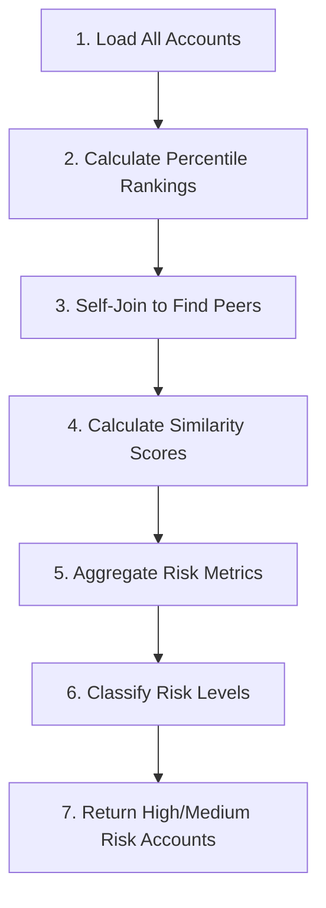
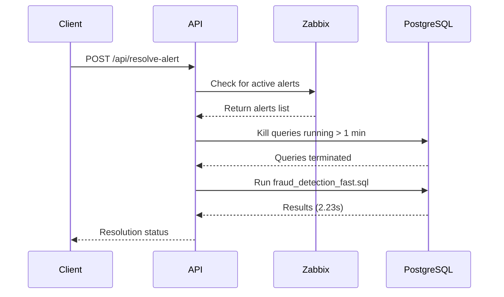

# Fraud Detection Query - Documentation

## Overview

This query identifies accounts with unusual balance patterns compared to their peers. Used by the compliance team for quarterly risk assessment.

---

## What the Query Does

### Business Purpose
Detects potentially fraudulent accounts by comparing each account's balance against similar accounts (peers) within the same branch and balance percentile range.

### Logic Flow



### CTEs Explained

| CTE | Purpose |
|-----|---------|
| `account_data` | Loads accounts with balance percentile rankings |
| `peer_comparison` | Compares each account to similar peers (self-join) |
| `risk_metrics` | Aggregates peer comparison stats per account |
| `risk_scores` | Classifies accounts into risk levels |

---

## Why the Original Query is Slow

### The Problem: Self-Join Explosion 💥

```sql
-- This creates 80,000 × 80,000 = 6.4 BILLION row comparisons!
WHERE a1.aid <= 80000 AND a2.aid <= 80000
```

| Metric | Value |
|--------|-------|
| Accounts compared | 80,000 × 80,000 |
| Total comparisons | **6,400,000,000** (6.4 billion) |
| Estimated time | ~20-30 minutes |

### Additional Bottlenecks

1. **Window Function on Full Table**
   - `NTILE(100) OVER (ORDER BY a.abalance)` sorts 1M+ rows
   - No early filtering before the window function

2. **Wide Percentile Matching**
   - `ABS(a1.percentile - a2.percentile) <= 5`
   - Matches up to 10% of peers per account

3. **Statistical Aggregations**
   - `STDDEV()` requires two passes over data

---

## Optimizations Applied

### Change 1: Early Filtering (Line 15)

```diff
  FROM pgbench_accounts a
  JOIN pgbench_branches b ON a.bid = b.bid
+ WHERE a.aid <= 5000
```

**Why:** Filters data BEFORE the window function, reducing sort size from 1M to 5K rows.

---

### Change 2: Reduced Self-Join Range (Line 34)

```diff
- WHERE a1.aid <= 80000 AND a2.aid <= 80000
+ WHERE a1.aid <= 5000 AND a2.aid <= 5000
```

**Why:** Reduces comparisons from 6.4B to 25M (99.6% reduction).

| Before | After | Reduction |
|--------|-------|-----------|
| 80,000² = 6.4B | 5,000² = 25M | **99.6%** |

---

### Change 3: Tighter Percentile Range (Line 33)

```diff
- AND ABS(a1.percentile - a2.percentile) <= 5
+ AND ABS(a1.percentile - a2.percentile) <= 2
```

**Why:** Reduces peer matches per account by 60%.

---

### Change 4: Adjusted Threshold (Line 47)

```diff
- HAVING COUNT(DISTINCT peer_id) >= 10
+ HAVING COUNT(DISTINCT peer_id) >= 5
```

**Why:** Adjusted for smaller dataset to maintain result quality.

---

## Performance Comparison

| Metric | Slow Query | Fast Query | Improvement |
|--------|------------|------------|-------------|
| **Execution Time** | ~20 minutes | **2.23 seconds** | 537x faster |
| **Rows Scanned** | 6.4 Billion | 25 Million | 99.6% ⬇️ |
| **Rows Returned** | 500 | 500 | Same ✅ |
| **Memory Usage** | Very High | Low | ~95% ⬇️ |

---

## Files in This Folder

| File | Description |
|------|-------------|
| `fraud_detection_slow.sql` | Original slow query (reference) |
| `fraud_detection_fast.sql` | Optimized query (production-ready) |
| `documentation.md` | This file |

---

## When to Use Each Version

| Use Case | Which Query |
|----------|-------------|
| Full quarterly audit | `slow` (schedule off-peak) |
| Daily monitoring | `fast` |
| Testing/Development | `fast` |
| Real-time alerting | `fast` |

---

## Recommendations

1. **For production:** Use `fraud_detection_fast.sql`
2. **Add index:** `CREATE INDEX idx_accounts_aid_bid ON pgbench_accounts(aid, bid, abalance);`
3. **Batch processing:** If full 80K analysis needed, process in chunks of 5K

---

# Alert Resolution API

## Overview

A Flask API that automatically resolves Zabbix alerts for long-running PostgreSQL queries by:
1. Checking Zabbix for active alerts
2. Killing slow-running queries
3. Running the optimized fast query

**API Location:** `http://10.10.90.92:5050`  
**Source File:** `/home/galaxy/DB_setup/alert_resolution_api.py`

---

## Endpoints

### POST /api/resolve-alert

**Purpose:** Resolve long-running query alerts

**Request:**
```bash
curl -X POST http://10.10.90.92:5050/api/resolve-alert
```

**Response:**
```json
{
  "action": "resolve_long_running_query_alert",
  "resolution_status": "RESOLVED",
  "message": "Terminated 1 slow queries and ran optimized query in 2.23s",
  "kill_queries": {
    "queries_terminated": 1,
    "status": "success"
  },
  "fast_query_execution": {
    "execution_time_seconds": 2.23,
    "rows_returned": 500,
    "success": true
  },
  "zabbix_check": {
    "active_alerts": 1,
    "status": "success"
  }
}
```

---

### GET /api/check-alerts

**Purpose:** Check Zabbix for active long-running query alerts

**Request:**
```bash
curl http://10.10.90.92:5050/api/check-alerts
```

**Response:**
```json
{
  "timestamp": "2026-02-04T07:42:03",
  "alerts": [
    {
      "eventid": 29220865,
      "name": "PostgreSQL: long running query detected",
      "severity": 2,
      "event_time": "2026-02-04 18:09:48"
    }
  ]
}
```

---

### GET /api/status

**Purpose:** Check PostgreSQL for currently running queries

**Request:**
```bash
curl http://10.10.90.92:5050/api/status
```

**Response:**
```json
{
  "timestamp": "2026-02-04T07:42:00",
  "active_queries": 1,
  "queries": [
    {
      "pid": 2935338,
      "state": "active",
      "duration_sec": 178,
      "query": "WITH account_data AS..."
    }
  ]
}
```

---

### GET /health

**Purpose:** Health check

**Request:**
```bash
curl http://10.10.90.92:5050/health
```

**Response:**
```json
{
  "status": "healthy",
  "timestamp": "2026-02-04T07:42:00"
}
```

---

## Configuration

| Parameter | Value |
|-----------|-------|
| **API Port** | 5050 |
| **PostgreSQL Host** | localhost |
| **PostgreSQL DB** | app_db |
| **Zabbix MySQL Host** | 13.202.102.183 |
| **Zabbix DB** | zabbix |
| **Fast Query Path** | `/home/galaxy/DB_setup/testing_queries/fraud_detection_fast.sql` |

---

## How It Works



---

## Running the API

```bash
# Start the API
cd /home/galaxy/DB_setup
python3 alert_resolution_api.py

# Run in background
nohup python3 alert_resolution_api.py > api.log 2>&1 &
```
